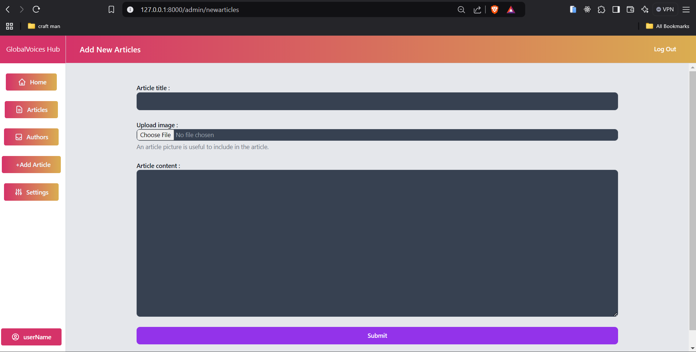

# Laravel Blog Application


## Overview

This is a Laravel-based blog application that includes functionality for guests, authors, and admins. The platform allows users to read, create, and manage articles, with different levels of access for each role. The application is designed for simplicity and efficiency, utilizing modern web technologies.

---

## Features

### Guest Features

-   Browse and read articles.
-   View article details.

### Author Features

-   Create, edit, and delete articles.
-   View and manage their own articles.
-   Like and comment on other authors' articles.

### Admin Features

-   Manage all articles (approve or delete).
-   Manage authors (add, update, or delete).
-   Create articles.

---

## Pages

### Home Page


### Register Page


### Login Page


### Forgot Password Page


### Main Page (All Articles)


### Article Details


### Create Article


### User Profile Page


### Author Managing Their Articles


### Admin Features

#### Manage Articles


#### Manage Authors


#### Create Articles as Admin



---

## Technologies Used

### Backend

-   Laravel 10
-   PHP 8.1

### Frontend

-   Vite
-   TailwindCSS

### Database

-   SQL (MySQL or equivalent)

---

## How to Run the Project

1. Clone the repository.

    ```bash
    git clone <repository-url>
    ```

2. Navigate to the project directory.

    ```bash
    cd ElmarrouniBlogTP-app
    ```

3. Install PHP dependencies.

    ```bash
    composer install
    ```

4. Install Node.js dependencies.

    ```bash
    npm install
    ```

5. Set up the environment.

    - Copy the `.env.example` file to `.env`.
    - Update the `.env` file with your database credentials and other configurations.

6. Run database migrations.

    ```bash
    php artisan migrate
    ```

7. Start the development server.

    ```bash
    php artisan serve
    ```

8. Start Vite.
    ```bash
    npm run dev
    ```

---

## Dependencies

### Composer Dependencies

-   Laravel Framework
-   Sanctum (Authentication)
-   Socialite (OAuth)
-   Tinker

### NPM Dependencies

-   Vite (Bundling)
-   TailwindCSS (Styling)

---

## Screenshots

### Home Page


For more details, explore the screenshots provided in the respective sections above.

---

## License

This project is licensed under the MIT License. See the LICENSE file for details.
